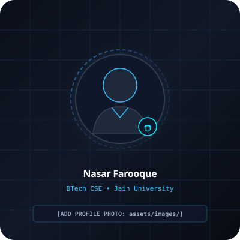

# Nasar Farooque - Personal Portfolio Website

A **premium, modern, highly interactive personal portfolio** crafted for **Nasar Farooque**, a BTech Computer Science Engineering student at Jain University, Bangalore.

Built with a **dark futuristic developer aesthetic**, clean glassmorphism, soft glowing accents, micro-interactions, an interactive constellation canvas, and zero heavy dependencies.

---

## 📁 Project Directory Structure

```text
nasar-portfolio/
│
├── index.html                   # Semantic HTML5 architecture & accessible layout
├── style.css                    # Futuristic dark styling, CSS variables & responsive rules
├── script.js                    # Interaction engine, configuration object & form validation
│
├── assets/
│   ├── images/
│   │   ├── avatar-placeholder.svg    # Sleek developer avatar placeholder with <NF /> badge
│   │   ├── project-portfolio.svg     # SVG mockup for Personal Portfolio
│   │   ├── project-fitness.svg       # SVG mockup for Fitness & Workout Website
│   │   └── project-student.svg       # SVG mockup for Student Productivity Platform
│   │
│   └── icons/
│       └── favicon.svg               # Glowing monogram browser favicon
│
└── README.md                    # Comprehensive documentation and customization guide
```

---

## ⚡ How to Run Locally in VS Code

You can run and preview this website locally using any of these simple methods:

### Method 1: VS Code "Live Server" Extension (Recommended)

1. Open **Visual Studio Code**.
2. Click **File** > **Open Folder...** and select:
   `/Users/nasarfarooque/.gemini/antigravity/scratch/nasar-portfolio`
3. Install the **Live Server** extension (by Ritwick Dey) from the VS Code Extensions Marketplace (`Ctrl+Shift+X` or `Cmd+Shift+X`, search for `Live Server`).
4. Right-click `index.html` in the file explorer and click **"Open with Live Server"** (or click **Go Live** on the bottom status bar).
5. Your browser will automatically open at `http://127.0.0.1:5500`. Changes saved in your files will auto-reload instantly!

### Method 2: Python Built-In HTTP Server (No Extensions Needed)

1. Open your terminal inside the project directory:
   ```bash
   cd /Users/nasarfarooque/.gemini/antigravity/scratch/nasar-portfolio
   ```
2. Start Python's built-in local server:
   ```bash
   python3 -m http.server 8000
   ```
3. Open your browser and navigate to:
   ```
   http://localhost:8000
   ```

### Method 3: Direct File Inspection

Simply double-click `index.html` in your file explorer to open it directly in Google Chrome, Brave, Safari, or Microsoft Edge.

---

## 🛠️ How to Customize Your Portfolio

This website was built specifically so that you can update any detail without breaking the layout.

### 1. Configuration in `script.js`

Open `script.js`. Right at the top (lines 13–68), you will find the `PORTFOLIO_CONFIG` object:

```javascript
const PORTFOLIO_CONFIG = {
  personal: {
    name: "Nasar Farooque",
    role: "BTech CSE Student | Developer | Tech Enthusiast",
    email: "[ADD YOUR EMAIL]",                // e.g. "nasar.farooque@example.com"
    githubUrl: "[ADD GITHUB URL]",            // e.g. "https://github.com/yourusername"
    linkedinUrl: "[ADD LINKEDIN URL]",        // e.g. "https://linkedin.com/in/yourusername"
    instagramUrl: "[ADD INSTAGRAM URL]",      // e.g. "https://instagram.com/yourusername"
    profilePhoto: "assets/images/avatar-placeholder.svg", // Change to "assets/images/your-photo.jpg"
  },
  ...
};
```

### 2. Adding Your Real Profile Photo

1. Place your photo (e.g. `nasar-photo.jpg` or `nasar-photo.png`) into the `assets/images/` directory.
2. In `index.html`, locate line ~160:
   ```html
   
   ```
   Replace `assets/images/avatar-placeholder.svg` with `assets/images/nasar-photo.jpg`.

### 3. Updating Social Links & Contact Details

Search in `index.html` for placeholders:
- `[ADD YOUR EMAIL]` → Replace with your email address (e.g. `nasarfarooque@gmail.com`).
- `[ADD GITHUB URL]` → Replace with your GitHub profile (e.g. `https://github.com/nasarfarooque`).
- `[ADD LINKEDIN URL]` → Replace with your LinkedIn profile (e.g. `https://linkedin.com/in/nasarfarooque`).
- `[ADD INSTAGRAM URL]` → Replace with your Instagram profile (e.g. `https://instagram.com/nasarfarooque`).

### 4. Customizing Projects

In `index.html`, within the `#projects` section, each project card is marked with `Editable Project`:
- To change titles, descriptions, or tech stack chips, edit the text inside each `<article class="project-card">`.
- Update the `href` attributes on the GitHub and Live Demo buttons to point directly to your deployed projects.
- You can also add more project cards by copying and pasting any `<article class="project-card">` block.

### 5. Adding Real Achievements & Hackathons

In `index.html`, within the `#achievements` section, there are 4 dedicated placeholder cards:
- `[Add Hackathon Achievement]`
- `[Add Coding Competition / Platform Rank]`
- `[Add Technical Certification / Coursework]`
- `[Add Workshop / Tech Event]`

Simply replace the bracketed placeholders with your actual events, dates, and ranks.

### 6. Connecting the Contact Form to a Live Inbox

The contact form currently has client-side validation built-in. When submitted, it prevents page reload and verifies the fields.

To receive emails in your real email inbox, choose either option:

#### Option A: Free Formspree Endpoint (Recommended - Takes 2 minutes)
1. Sign up for free at [formspree.io](https://formspree.io).
2. Create a new form and copy your Formspree endpoint URL (e.g. `https://formspree.io/f/xyzabcde`).
3. In `index.html`, update the `<form>` opening tag:
   ```html
   <form id="contact-form" action="https://formspree.io/f/YOUR_ENDPOINT_ID" method="POST">
   ```
4. In `script.js`, inside `initContactFormValidation()`, change `e.preventDefault()` to allow submission or send via `fetch()`.

#### Option B: EmailJS
Integrate the [emailjs.com](https://www.emailjs.com/) browser SDK to send messages without any backend server.

---

## 🎨 Theme & Styling Configuration

All colors and visual properties are controlled via CSS custom properties in `style.css` under `:root`:

- `--accent-cyan`: `#00f2fe`
- `--accent-blue`: `#38bdf8`
- `--accent-indigo`: `#6366f1`
- `--bg-base`: `#06080d`
- `--bg-card`: `rgba(14, 20, 34, 0.72)`

You can change any accent color in `style.css` to instantly update the glowing aesthetics across all buttons, cards, and animations.

---

## ♿ Accessibility & Performance Features

- **Semantic HTML5:** Native `<header>`, `<nav>`, `<main>`, `<section>`, `<article>`, `<footer>`.
- **Keyboard Navigation:** Full tab navigation and clear `:focus-visible` outlines.
- **Accessible ARIA:** `aria-label`, `aria-expanded`, `aria-controls`, and `aria-hidden` properly configured.
- **Motion Safety:** Respects `prefers-reduced-motion: reduce` by disabling canvas movement and rapid transitions for sensitive users.
- **Fast & Dependency-Free:** Zero jQuery, zero bulky CSS frameworks; lightweight pure vanilla code for maximum Lighthouse scores.
- **High-DPI Ready:** High-resolution SVG illustrations and crisp iconography.

---

## 📄 License & Attribution

Designed and built for **Nasar Farooque** (BTech Computer Science Engineering student).
All rights reserved © 2026.
